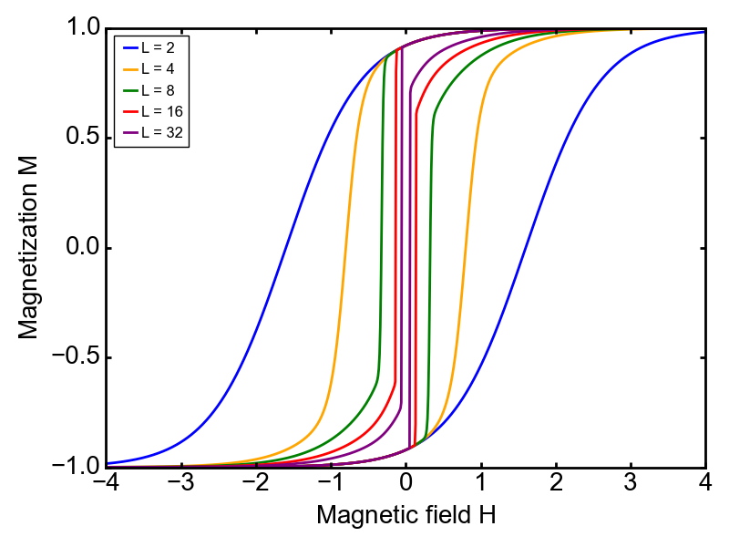

# Metastable Ising System

This repository contains the implementation and corrections of the calculations presented in the paper titled *"Metastable reverse-phase droplets within ordered phases: Renormalization-group calculation of field and temperature dependence of limiting size"* (Ege Eren & A. Nihat Berker, [PhysRevE.101.042127](https://journals.aps.org/pre/abstract/10.1103/PhysRevE.101.042127)).

## Overview

The study focuses on the metastability of reverse-phase droplets in an ordered Ising system. The key contribution of the paper is the application of renormalization-group (RG) theory to calculate the size limits of these metastable droplets as functions of external magnetic field and temperature. This repository contains the reproduction of these calculations, with several corrections and improvements.

### Paper Abstract

The original paper describes the renormalization-group-based calculation of metastable droplet sizes in a three-dimensional Ising model. The key results include the determination of maximal droplet sizes and hysteresis loops under various magnetic field strengths and temperatures. The paper applies the Migdal-Kadanoff renormalization-group method, producing phase diagrams and analytical results, which are verified using these computational methods.

### Corrections

During the reproduction of the results, discrepancies were identified in the calculation of certain renormalization-group transformations and threshold droplet sizes. After thorough revisions and discussions with the original authors, these errors were addressed, and the updated version (v2) of the paper, incorporating these corrections, was uploaded to arXiv ([arXiv:2003.01359v2](https://arxiv.org/pdf/2003.01359)).

## Repository Contents

- `renormalization.py`: Python script that implements the Migdal-Kadanoff renormalization-group calculations for the Ising model in three dimensions, and the other calculations depending on the RG calculations, including treshold droplet size, critical point, density, and hysteresis.
- `metatable_droplets.ipynb`: Jupyter notebook for application of the methods in `renormalization.py`. Calculations of the densities, metastable droplet sizes, and hysteresis loops.
- `figures/`: Directory containing resulting plots for the densities, metastable droplet sizes, and hysteresis loops.

## Results

  <table style="border: none; border-collapse: collapse;">
    <tr>
      <td style="padding: 20px;">
         
        <em style="color: #666;">Metastable Droplets</em>
      </td>
      <td style="padding: 20px;">
         
        <em style="color: #666;">Hysteresis Loops</em>
      </td>
    </tr>
  </table>

The repository reproduces the key results from the paper:

- **Metastable droplet sizes** as a function of the external magnetic field and droplet size. Resulting figure shows magnetization inside a would-be droplet of negative magnetization immersed in the positive magnetization phase, as a function of droplet size. Results for different magnetic fields are provided. A droplet is a finite region of the opposite thermodynamic phase persisting inside the equilibrium phase. Even as a metastable region, a droplet can exist up to a certain (critical) size, depending on how far away, in the thermodynamic external (applied) variables, the system is from the boundary in thermodynamic space where the phase of the droplet becomes stable. The
further away, the smaller the maximal droplet size, up to a certain limit, beyond which metastable droplets do not exist. This critical droplet size and this limit of metastable droplet existence are obtained, based on a microscopic statistical mechanical (renormalization-group) calculation.
- **Hysteresis loops** for systems of varying size at constant temprature. Hysteresis loops occurs in systems composed of finite microdomains. As the magnetization measurements/calculations are made, the system carries a memory of the previous measurement/calculation.

The corrected results offer improved accuracy in the droplet size calculations, especially near the critical thresholds of the system.

## References

1. Eren, E., & Berker, A. N. (2020). Metastable reverse-phase droplets within ordered phases: Renormalization-group calculation of field and temperature dependence of limiting size. Physical Review E, 101(4), 042127. DOI: 10.1103/PhysRevE.101.042127
2. Corrected version: arXiv:2003.01359v2

## License

This project is licensed under the MIT License. For details, see the [LICENSE](LICENSE) file.